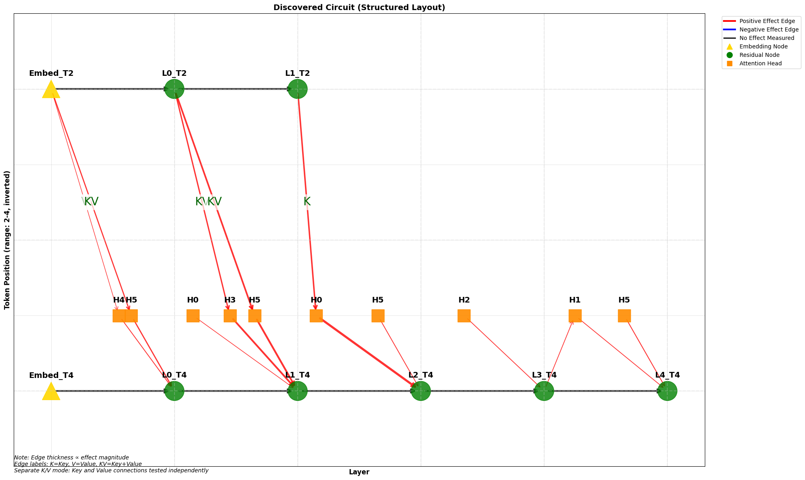

# LLM Circuit Discovery with Simple ACDC

A simplified and custom implementation of Automatic Circuit Discovery (ACDC) for transformer language models, focusing on interpretability and circuit analysis using activation patching techniques.

## 🔍 Overview

This project implements a streamlined version of ACDC that discovers computational circuits within transformer models by identifying the minimal set of components responsible for specific behaviors. Unlike the original ACDC which prunes from a full computational graph, this implementation uses an incremental building approach for better efficiency and interpretability.

## ✨ Key Features

- **Enhanced ACDC Implementation**: Circuit discovery with merging and filtering capabilities
- **Performance Optimized**: Smart caching system for faster circuit discovery
- **Circuit Merging**: Combine and filter multiple circuits for comparative analysis
- **Advanced Visualization**: Dynamic head positioning and color-coded edge weights
- **Q-K Analysis Tools**: Analyze attention mechanisms with dot product computation
- **Multi-Text Comparison**: Compare circuits across multiple corrupted texts
- **Interactive Visualization**: NetworkX-based circuit graphs with merged edge display
- **Threshold Sweeping**: Automated parameter exploration with enhanced metrics
- **Attention Granularity**: Separate key/value analysis for fine-grained attention circuits

## 🎨 Example Circuit Visualization

Here's an example circuit discovered for the idiom "kicked the bucket" → "died":



This visualization shows the discovered computational circuit for understanding how the model processes the idiom "He kicked the bucket" and relates it to the meaning "He died". The circuit was discovered using:

- **Original text**: "He kicked the bucket" 
- **Corrupted text**: "He booted the bucket" (minimal word change)
- **Target**: "He died" (semantic meaning)
- **Threshold**: 0.017

### Circuit Interpretation

The graph shows:

- **Nodes**: Represent components in the transformer (residual streams, attention heads)
- **Edges**: Show information flow with effect sizes as edge weights
- **Colors**: Different node types (residual vs attention components)
- **Edge Types**: 
  - `resid`: Residual stream connections between layers
  - `attn_out`: Attention head outputs to residual stream  
  - `query`: Query connections from residual to attention heads
  - `key`/`value`: Key/Value connections from previous tokens (when `separate_kv=True`)

This particular circuit reveals how the model identifies and processes the idiomatic meaning of "kicked the bucket" by tracking the key components involved in semantic transformation from literal action to metaphorical meaning.

## 🚀 Quick Start

### Installation

1. Clone the repository:
```bash
git clone https://github.com/agomes42/LLMConstructions
cd LLMConstructions
```

2. Create a virtual environment:
```bash
python -m venv .venv
source .venv/bin/activate  # On Windows: .venv\Scripts\activate
```

3. Install dependencies:
```bash
pip install -r requirements.txt
```

### Basic Usage

**⚠️ Important**: Always use `gemma_utils.load_gemma_model()` for proper model configuration and device settings.

```python
import gemma_utils
import simple_acdc

# Load model (IMPORTANT: Use gemma_utils for proper model configuration)
model, tokenizer = gemma_utils.load_gemma_model()

# Initialize ACDC
acdc = simple_acdc.SimpleACDC(model, max_layer=4, threshold=0.01, separate_kv=True)

# Discover circuit
circuit, effect = acdc.discover_circuit(
    original_text="He kicked the bucket",
    corrupted_text="He kicked the buckets", 
    target_text="He died",
    min_token_pos=2
)

# Visualize results
acdc.visualize_circuit(circuit, save_path="circuit.png")

# Advanced: Build and merge multiple circuits
merged_circuit, individual_circuits, effects = simple_acdc.build_and_merge_circuits(
    model=model,
    max_layer=4,
    original_text="He kicked the bucket",
    corrupted_texts=["He kicked the buckets", "He kicked the pail"],
    target_text="He died",
    thresholds=[0.01, 0.015],
    visualize_individual=True
)

# Analyze attention with Q-K dot products
simple_acdc.compute_qk_dot_products(model, ["He kicked the bucket", "face the music"], 
                                   layer=2, head=3, q_index=2, k_index=1)
```

### Multi-Text Analysis

```python
from simple_acdc import multi_corrupted_threshold_sweep

# Compare across multiple corruptions
results = multi_corrupted_threshold_sweep(
    model, 
    original_text="He kicked the bucket",
    corrupted_texts=[
        "He kicked the buckets", 
        "He kicked the pail",
        "He kicked a bucket"
    ],
    target_text="He died",
    thresholds=(0.001, 0.04, 0.001),
    max_layer=4
)
```

## 🧠 Algorithm Overview

### Circuit Discovery Process

1. **Root Initialization**: Start with final token at maximum layer
2. **Breadth-First Traversal**: Explore computational graph in reverse layer order
3. **Activation Patching**: Test component importance using clean vs corrupted activations
4. **Effect Measurement**: Use cosine similarity between embeddings and target text
5. **Threshold Selection**: Include components with effect size ≥ threshold
6. **Smart Caching**: Cache activations for performance optimization

### Circuit Components

- **Residual Nodes**: Represent residual stream states at (layer, token position)
- **Attention Nodes**: Represent attention head outputs at (layer, head, token position)
- **Circuit Merging**: Union-based combination of multiple circuits with filtering options
- **Edge Types**:
  - `resid`: Layer-to-layer residual connections
  - `attn_out`: Attention head output to residual stream
  - `query`: Query connections from residual to attention
  - `key`/`value`: Key/Value connections (separate when `separate_kv=True`)
  - `key_value`: Combined K/V connections (when `separate_kv=False`)

## 🔧 Core Components

### SimpleACDC Class

The main class for circuit discovery with the following key methods:

- `discover_circuit()`: Find minimal circuit for a behavior
- `visualize_circuit()`: Create graph visualization
- `get_effect()`: Measure component importance
- `_cache_activations()`: Performance optimization

### Utility Functions

- `threshold_sweep()`: Explore threshold parameter space with enhanced edge counting
- `build_and_merge_circuits()`: Create and combine multiple circuits with workflow visualization
- `filter_circuit_nodes()`: Filter circuits by labels or membership criteria
- `compute_qk_dot_products()`: Analyze Q-K attention dot products with token identification
- `multi_corrupted_threshold_sweep()`: Compare across corruptions
- `visualize_sweep_results()`: Plot threshold sweep results

## 📊 Performance Optimizations

- **Smart Caching**: Cache clean and corrupted activations
- **Earliest Layer Tracking**: Skip unnecessary computations
- **Incremental Plotting**: Real-time visualization during long runs
- **Edge Merging**: Combine multiple edges in visualization

## 🎯 Use Cases

- **Interpretability Research**: Understand how language models process information
- **Circuit Analysis**: Identify computational pathways for specific behaviors
- **Attention Mechanisms**: Study key/value attention patterns
- **Model Debugging**: Find components responsible for specific outputs
- **Comparative Analysis**: Compare circuits across different corruptions

## 📈 Example Analyses

The project includes several example analyses:

1. **Idiom Processing**: "kicked the bucket" → "died" circuits
2. **Threshold Sensitivity**: Effect of different threshold values
3. **Corruption Robustness**: How circuits change with different corruptions
4. **Attention Granularity**: Separate key/value vs combined analysis

## 📚 References

- [ACDC: Automatic Circuit Discovery](https://arxiv.org/abs/2304.14997)
- [TransformerLens Documentation](https://transformerlensorg.github.io/TransformerLens/)
- [Gemma 2 2B](https://arxiv.org/abs/2408.00118)
