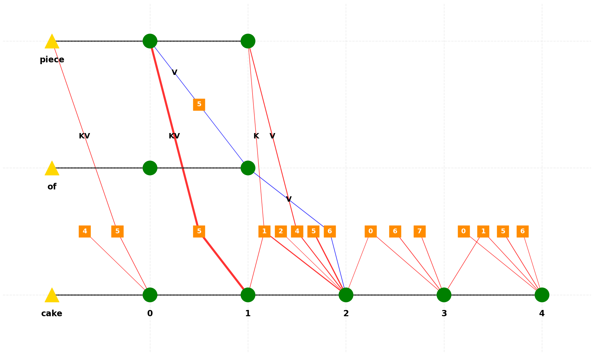

# LLM Circuit Discovery for Idioms

A custom implementation of Automatic Circuit Discovery (ACDC) for transformer language models. This repo contains all code and examples for the paper [Anatomy of an Idiom: Tracing Non-Compositionality in Language Models](https://arxiv.org/abs/2511.16467).


## Key Features

- **Attention Granularity**: Separately patches Q/K/V connections for fine-grained attention circuits
- **Circuit Merging**: Circuit discovery with merging of single-corruption circuits into a single circuit representing an idiom's processing
- **Advanced Visualization**: Dynamic head positioning and color-coded edge weights
- **Q-K Analysis Tools**: Analyze attention mechanisms with dot product computation
- **Threshold Sweeping**: Automated circuit threshold parameter exploration with enhanced metrics


## Example Circuit Visualization

Here is an example (single-corruption) circuit discovered for the idiom "a piece of cake" → "easy":



This visualization shows the discovered computational circuit for how the model processes the idiom "That was a piece of cake" and relates it to the meaning "That was easy". The circuit was discovered using:

- **Original text**: "That was a piece of cake" 
- **Corrupted text**: "That was a chunk of cake" (minimal word change)
- **Target**: "That was easy" (semantic meaning)
- **Threshold**: 0.005

### Circuit Interpretation

The graph shows:

- **Nodes**: Represent components in the transformer (residual streams, attention heads)
- **Edges**: Show information flow with effect sizes as edge weights
- **Colors**: Different node types (residual vs attention components)
- **Edge Types**: 
  - `resid`: Residual stream connections between layers
  - `attn_out`: Attention head outputs to residual stream  
  - `query`: Query connections from residual to attention heads
  - `key`/`value`: Key/Value connections from previous tokens (when `separate_kv=True`)

This particular circuit reveals how the model identifies and processes the idiomatic meaning of "a piece of cake" by tracking the key components involved in semantic transformation from literal action to metaphorical meaning. Many such single-corruption circuits can be merged to form a comprehensive idiom circuit.


## Quick Start

Also see [idiom_tests.ipynb](idiom_tests.ipynb) for full examples.

### Installation

1. Clone the repository:
```bash
git clone https://github.com/agomes42/LLMConstructions
cd LLMConstructions
```

2. Create a virtual environment:
```bash
python -m venv .venv
source .venv/bin/activate  # On Windows: .venv\Scripts\activate
```

3. Install dependencies:
```bash
pip install -r requirements.txt
```

### Basic Usage

**Important**: Always use `gemma_utils.load_gemma_model()` for proper model configuration and device settings.

```python
import gemma_utils
import simple_acdc

# Load model (IMPORTANT: Use gemma_utils for proper model configuration)
model, tokenizer = gemma_utils.load_gemma_model()

# Initialize ACDC
acdc = simple_acdc.SimpleACDC(model, max_layer=4, threshold=0.01, separate_kv=True)

# Discover circuit
circuit, effect = acdc.discover_circuit(
    original_text="He kicked the bucket",
    corrupted_text="He kicked the buckets", 
    target_text="He died",
    min_token_pos=2
)

# Visualize results
acdc.visualize_circuit(circuit, save_path="circuit.png")

# Advanced: Build and merge multiple circuits
merged_circuit, individual_circuits, effects = simple_acdc.build_and_merge_circuits(
    model=model,
    max_layer=4,
    original_text="He kicked the bucket",
    corrupted_texts=["He kicked the buckets", "He kicked the pail"],
    target_text="He died",
    thresholds=[0.01, 0.015],
    visualize_individual=True
)

# Analyze attention with Q-K dot products
simple_acdc.compute_qk_dot_products(model, ["He kicked the bucket", "face the music"], 
                                   layer=2, head=3, q_index=2, k_index=1)
```

### Multi-Text Analysis

```python
from simple_acdc import multi_corrupted_threshold_sweep

# Compare across multiple corruptions
results = multi_corrupted_threshold_sweep(
    model, 
    original_text="He kicked the bucket",
    corrupted_texts=[
        "He kicked the buckets", 
        "He kicked the pail",
        "He kicked a bucket"
    ],
    target_text="He died",
    thresholds=(0.001, 0.04, 0.001),
    max_layer=4
)
```


## Core Components

### SimpleACDC Class

The main class for circuit discovery with the following key methods:

- `discover_circuit()`: Find minimal circuit for a behavior
- `visualize_circuit()`: Create graph visualization
- `threshold_sweep()`: Explore threshold parameter space with enhanced edge counting
- `build_and_merge_circuits()`: Create and combine multiple circuits with visualization
- `compute_qk_dot_products()`: Analyze Q-K attention dot products with token identification


## References

- [ACDC: Automatic Circuit Discovery](https://arxiv.org/abs/2304.14997)
- [TransformerLens Documentation](https://transformerlensorg.github.io/TransformerLens/)
- [Gemma 2-2B](https://arxiv.org/abs/2408.00118)
